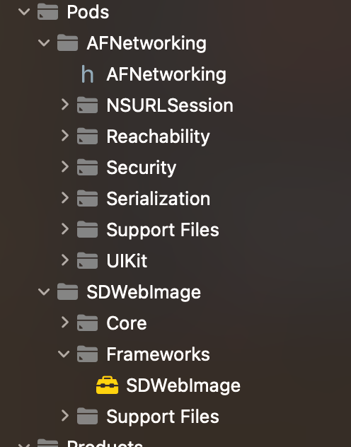

# cocoapods-zjbinary

通过提前编译组件形成二进制文件，来加快编译速度。支持源码和二进制切换，保留源码，可以进行代码查看。支持缓存，可以快速从缓存拉取二进制组件

## 背景

随着组件化开发模式背景下，组件越来越多，不少工程面临编译时间长的问题

## 效果图

#### 运行效果

##### 1 .a静态库


##### 2.framework 静态库




#### 缓存的目录结构


## 插件安装
````shell
$ gem install cocoapods-zjbinary
````

## 使用
在 podfile 文件中加入以下代码

#### 1.1 使用静态库.a 编译：（cocoapods 日常不添加use_frameworks的情况）

```ruby
plugin 'cocoapods-zjbinary'
use_static_binary!
```


#### 1.2 使用静态库 framewrok编译：
````ruby
plugin 'cocoapods-zjbinary'
use_frameworks! :linkage => :static
use_static_binary!
````


#### 1.3使用静态库 framewrok编译：

````ruby
plugin 'cocoapods-zjbinary'
use_frameworks!
use_dynamic_binary!
````
#### 2. 如果组件不想使用二进制可以加参数 :binary => false

````ruby
pod 'AFNetworking', :binary => false #依赖库也不会预编译。
````
#### 3. 设置编译完成后移除源码，默认保存

````ruby
remove_source_code_for_prebuilt_frameworks!
````
#### 4. 设置二进制缓存仓库，可直接从缓存库拉取二进制组件
````ruby
set_local_binary_cache_path     '/Users/xxx/podBinaryCache'
````
#### 5. 设置二进制默认缓存地址，开启后默认地址为：/Users/xxx/Desktop/podCache,方便打包机读取二进制缓存地址，如果用set_local_binary_cache_path设置的地址，会在其他电脑不匹配

```ruby
set_default_desktop_cache_path!  
```

## 

## 源码调试

在有dsym的情况下，可以直接进行源码调试功能

## 注意

由于一些分类组件，打包成framework时，+号会变成下划线，如果有单独引用的，建议添加:binary => false

## 参考

https://github.com/leavez/cocoapods-binary

https://github.com/pdcodeunder/cocoapods-ppbuild

## License

MIT

如果喜欢，给个 星星⭐️ 鼓励一下，如果需要源码的小伙伴较多，那后续也可以上传二进制插件源码
